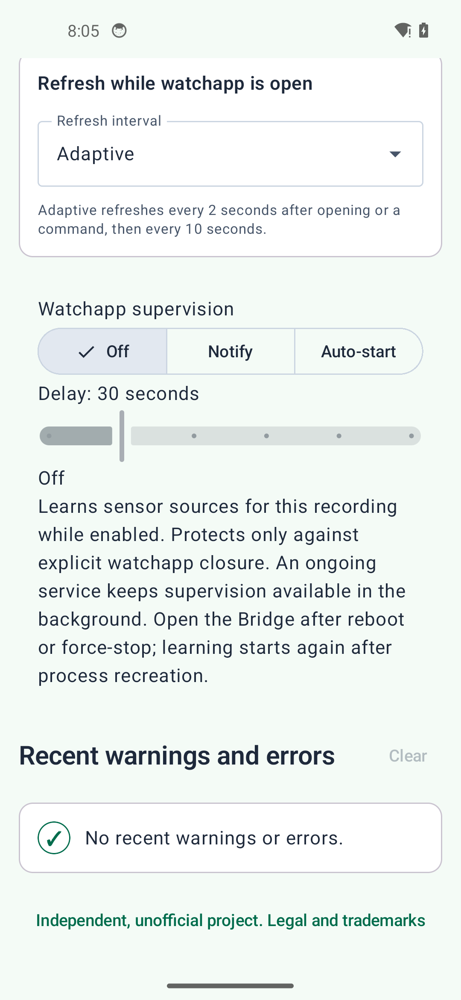

Android Bridge Settings
=======================

The Android bridge connects the watchapp to Locus and reports whether each part of that connection
is working.

.. image:: _static/bridge_app_light.png
   :alt: TrackGlance Android Bridge status screen in light mode with Pebble and Locus connected
   :align: center
   :width: 320px

Refresh Mode
------------

Refresh mode controls how often the bridge asks Locus for updated recording information.

* **Adaptive** sends an immediate update when the watchapp opens or a command is used. It checks
  every two seconds for the first 15 seconds, then every ten seconds to reduce battery use.
* **Every 5 seconds** provides consistently frequent updates.
* **Every 10 seconds** reduces update frequency and battery use.

Watchapp supervision
--------------------

Choose **Off**, **Notify**, or **Auto-start** in the Android Bridge. New and upgraded installations
start with **Off** and a **30-second** delay. The delay slider has six positions, from 15 to 90
seconds. Turning supervision Off retains the selected delay.

While enabled, supervision learns whether the current Locus recording receives valid watch heart
rate, available step updates (including zero steps), or both. The status shows **Waiting for sensor
data** until a source is learned, then identifies the active sources. Watch Settings still control
which sensors the watch sends.

An explicit watchapp-close callback starts the delay. **Notify** then posts one alert with a
**Start watchapp** action. **Auto-start** first attempts to launch the watchapp and waits five seconds
for its open callback. If recovery fails, it posts the alert and retries silently, up to three
automatic attempts. Attempts start at least the selected delay apart. Manual starts do not consume
or reset that budget. Dismissing an alert does not stop retries or cause another alert for the same
outage. Tapping the notification opens the Bridge.

An open callback clears the outage. Pausing clears its alert and pending work but retains learned
sources. Resuming while the watchapp remains closed starts a fresh delay and retry budget. If Locus
becomes unavailable or cannot identify the recording, actions are suspended; the alert and retry
count remain. When the same recording becomes available, supervision waits a full delay again.
Stopping, replacing the recording, or choosing Off clears the learned sources.

An ongoing foreground service keeps supervision available while the Bridge is hidden, including
while waiting for sensor data. Short, bounded wake locks cover outage deadlines and launch
confirmation. After Android recreates the process, the selected settings remain but sensor learning
starts again. After reboot or force-stop, open the Bridge to restart supervision.

Android asks for notification permission when you select Notify or Auto-start. If permission or the
outage notification channel is blocked, Notify switches Off with an explanation and a link to
notification settings. Auto-start remains enabled, but failure alerts are blocked. The ongoing
status and outage alerts use separate channels; Android sound and vibration settings remain
authoritative.

Connection Status and Troubleshooting
-------------------------------------

The main screen reports the Pebble App connection, Pebble watch connection, Locus availability,
recording state, active Locus profile, current heart rate, and recent bridge errors. Use this page
first when the watch does not leave the stopped screen, reports Locus unavailable, or remains on
``Preparing profile...``.

.. _bridge-heart-rate-status:

Heart-rate status
-----------------

The Heart rate card distinguishes the latest value received from Locus, the latest sample received
from the watch, and the last time a watch sample was forwarded. See :ref:`heart-rate-on-watch` for
the two data directions and :ref:`heart-rate-settings` for Pebble Time 2 forwarding controls.

Watch appearance, activity pages, metrics, and heart-rate forwarding are documented separately
in the :doc:`user-guide`.

Units are configured in Locus Map, not on this screen. The bridge reads Locus's distance,
altitude, speed, slope, and energy preferences and sends already converted, Locus-style compact
values to the watch. A preference change appears within about 60 seconds while the bridge is active.
