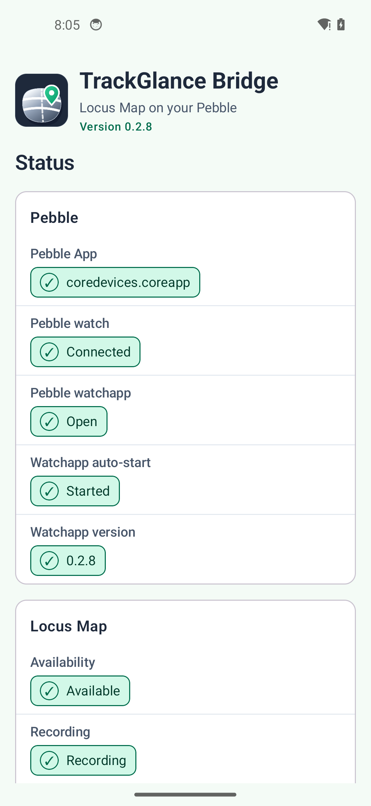

Android Bridge Settings
=======================

The Android bridge connects the watchapp to Locus and reports whether each part of that connection
is working.

Refresh Mode
------------

Refresh mode controls how often the bridge asks Locus for updated recording information.

* **Adaptive** sends an immediate update when the watchapp opens or a command is used. It checks
  every two seconds for the first 15 seconds, then every ten seconds to reduce battery use.
* **Every 5 seconds** provides consistently frequent updates.
* **Every 10 seconds** reduces update frequency and battery use.

Connection Status and Troubleshooting
-------------------------------------

The main screen reports the Pebble App connection, Pebble watch connection, Locus availability,
recording state, active Locus profile, current heart rate, and recent bridge errors. Use this page
first when the watch does not leave the stopped screen, reports Locus unavailable, or remains on
``Preparing profile...``.

.. _bridge-heart-rate-status:

Heart-rate status
-----------------

The Heart rate card distinguishes the latest value received from Locus, the latest sample received
from the watch, and the last time a watch sample was forwarded. See :ref:`heart-rate-on-watch` for
the two data directions and :ref:`heart-rate-settings` for Pebble Time 2 forwarding controls.

Watch appearance, activity pages, metrics, and heart-rate forwarding are documented separately
in the :doc:`user-guide`.

Units are configured in Locus Map, not on this screen. The bridge reads Locus's distance,
altitude, speed, slope, and energy preferences and sends already converted, Locus-style compact
values to the watch. A preference change appears within about 60 seconds while the bridge is active.
