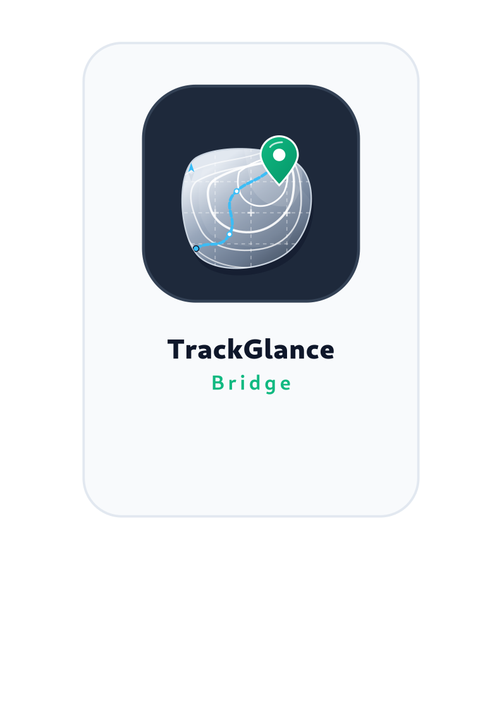

TrackGlance Documentation
==============================

.. meta::
   :description: TrackGlance displays and controls Locus Map track recordings on supported Pebble Time 2 and Pebble Round 2 smartwatches.

**For Locus Map and Pebble smartwatches.**

Use this guide to set up TrackGlance, choose what appears on your watch, and control Locus
recordings from your wrist after starting them in Locus Map.

.. toctree::
   :maxdepth: 2
   :caption: Contents:

   getting-started
   features
   watchapp-options
   watch-settings
   configuration
   flow
   limitations
   legal
