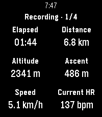
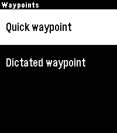
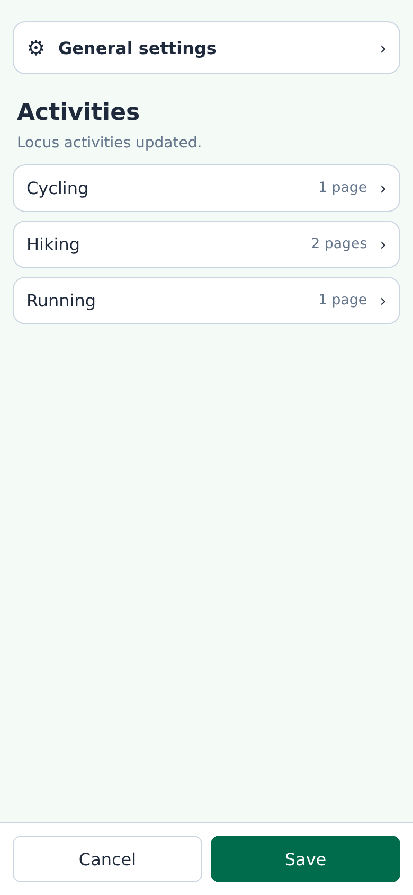
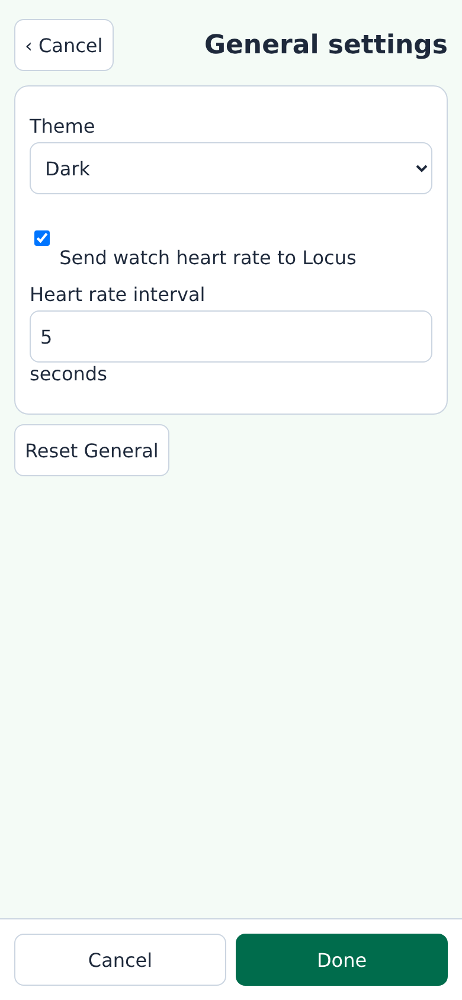
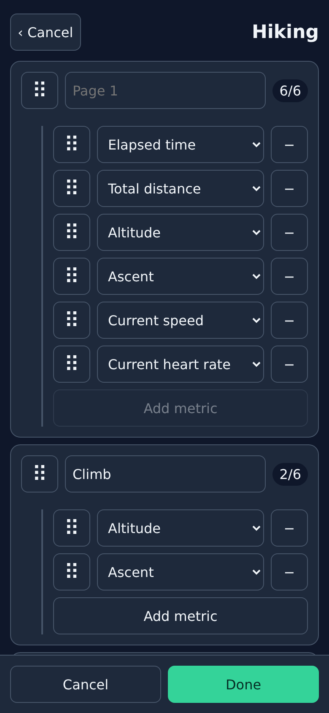

User Guide
==========

.. _on-watch-operation:

On-watch operation
------------------

Start the desired activity in Locus Map. While no recording is active, the watch hides metrics and
controls and says **No recording. Start recording in Locus Map.** If Locus cannot be reached, a
separate screen asks you to open Locus on the phone. **Select** has no action on either screen.

During recording or pause, **Up** and **Down** move between activity pages and **Select** opens the
available recording controls. A new recording starts on page 1.

.. _activity-pages:

Activity pages
--------------

An active recording shows one page at a time. Press **Up** for the previous page and **Down** for
the next; navigation wraps at both ends. A mid-recording watch-app launch starts on page 1. Manual
selection survives pause and resume, and a settings update keeps the selected page when that page
still exists.

The header remains visible as ``Recording · 1/4`` or ``Paused · 1/4`` and therefore shows both
recording state and page count. The page name appears briefly after a switch. A snapshot older than
30 seconds is marked stale, and unavailable values use an em dash.

.. _recording-controls:

Recording controls
------------------

Press **Select** during an active recording:

.. list-table::
   :header-rows: 1

   * - State
     - Controls
   * - Recording
     - Pause, Stop & save, Waypoints
   * - Paused
     - Resume, Stop & save
   * - Stopped or unavailable
     - No controls

**Stop & save** requires confirmation. On Pebble Time 2, **Waypoints** opens a submenu with
**Quick waypoint** and **Dictated waypoint**. Quick waypoint immediately saves a point named
``Pebble waypoint``; dictation uses the confirmed transcription. Pebble Round 2 provides a direct
**Add waypoint** action for the quick waypoint.

.. _heart-rate-on-watch:

Heart rate
----------

``Current heart rate`` is part of Locus telemetry and can be placed on an activity page for either
supported watch. Pebble Time 2 can also send its own raw sensor samples in the other direction,
from the watch to Locus, when forwarding is enabled under :ref:`heart-rate-settings`.

If the Pebble Time 2 sensor is unavailable, the watch briefly reports **Heart rate unavailable**
and sends no watch-originated samples. If sampling starts but produces no valid reading, it reports
**No heart rate**. In either case, Locus telemetry—including a heart rate supplied by another
sensor—continues unchanged. Pebble Round 2 does not offer watch-to-Locus forwarding.

See the :ref:`heart-rate-feature` overview for the two directions at a glance and
:ref:`bridge-heart-rate-status` for the corresponding Android Bridge diagnostics.

.. _watch-settings:

Watch Settings
--------------

Open Watch Settings in the **Pebble App**. The overview lists detected Locus activities
alphabetically and shows the enabled-page count for each. A notice says whether the catalog was
just updated or comes from the saved cache. A separate **General settings** row appears above the
activity list.

.. _heart-rate-settings:

General settings
----------------

General settings contains the watch's light or dark theme. On Pebble Time 2 it also contains
**Send watch heart rate to Locus** and the **Heart rate interval**. Forwarding is off by default.
The interval accepts whole seconds from 1 through 60 and defaults to 5 seconds. These heart-rate
controls are not shown for Pebble Round 2 because that watch cannot forward sensor samples.

Forwarding is active only while Locus is recording and remains best effort because Locus does not
acknowledge the sensor interface. See :ref:`heart-rate-on-watch` for sensor-unavailable behavior
and :ref:`heart-rate-feature` for the distinction between displaying Locus heart rate and sending
watch heart rate.

Editing an activity
-------------------

Select an activity to edit its four ordered page slots. The Locus activity name is read-only. An
active page has a custom-name field, a ``1/6`` through ``6/6`` metric counter, and ordered metric
rows. Metrics are indented beneath the page with a vertical guide. Leave the name blank for a
localized ``Page N`` name. Display names may repeat.

An inactive slot shows ``Inactive page`` and ``0/6``. Adding its first metric activates it.
Removing the last metric deactivates a page and preserves its hidden custom name, but at least one
page must stay active. Metrics are unique within a page but may repeat on different pages. A full
``6/6`` page keeps **Add metric** visible but disabled.

Six-dot handles drag page slots and metrics. A full page cannot accept another metric, but it does
not interrupt a drag to a later page. The editor scrolls when a dragged item approaches the top or
bottom edge.

Tap a six-dot handle without dragging to open its movement menu. Page menus provide **Move up** and
**Move down**. Metric menus provide movement within the current page and append-to-page actions for
the other slots. Full destinations and pages already containing that metric stay visible with an
explanation but cannot be selected. The menu stays open for repeated adjustments.

For keyboard or switch access, focus a six-dot handle and press Space or Enter to pick up the item.
Use Up and Down to move it within or between pages, then press Space or Enter again to drop it.
Escape cancels the move. Invalid destinations are identified without changing the draft.

Save, cancel, and reset
-----------------------

**Done** applies an activity or General settings screen to the main unsaved draft. **Cancel** on a
subpage discards only that screen's changes. Press **Save** on the overview to send the complete
draft to the watch, or **Cancel** there to close Watch Settings without saving.

Activity reset restores that activity's heuristic first page and three inactive slots. General
reset restores the dark theme, disables watch-to-Locus heart-rate forwarding, and returns its
interval to five seconds. The two reset actions do not affect one another. Leaving or resetting an
activity also clears transient movement menus, picked-up items, and messages.
