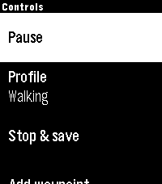
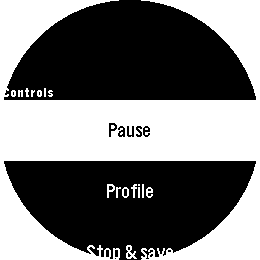

Watchapp Options
================

Dashboard
---------

The main screen shows the current Locus recording state and between one and six metrics from the
selected display profile. During a recording, elapsed time continues to advance between bridge
updates. A snapshot older than 30 seconds is marked ``stale``; unavailable metric values appear as
an em dash.

Press **Select** from the dashboard to open **Controls**. Use **Up** and **Down** to move through a
menu, **Select** to activate an item, and **Back** to return without changing anything.

Controls Menu
-------------

The first action follows the current Locus state:

.. list-table::
   :header-rows: 1
   :widths: 24 32 44

   * - Locus state
     - First action
     - Additional actions
   * - Stopped
     - Start recording
     - Profile
   * - Recording
     - Pause
     - Profile, Stop & save, Add waypoint, Add waypoint + note
   * - Paused
     - Resume
     - Profile, Stop & save
   * - Unavailable
     - Locus unavailable (disabled)
     - Profile

Recording Actions
-----------------

**Start recording** starts Locus with the exact Locus profile mapped to the selected watch profile.
**Pause** and **Resume** toggle the current recording state. **Stop & save** opens a confirmation
screen with **Save & stop** and **Cancel**, preventing an accidental finish.

On affected recent Android and Locus versions, bring Locus Map to the phone's foreground before
selecting **Start recording**, and leave it visible until recording begins. Android can otherwise
allow Locus to receive START while denying its newly created recording service access to location
or sensors. This foreground step is a compatibility workaround; it is not a documented requirement
of Locus's broadcast API.

Commands are sent to the Android bridge. The watch briefly reports delivery or command errors when
the phone, bridge, or Locus cannot complete an action.

Profiles
--------

**Profile** opens the profiles created in the phone-side settings. The active profile is marked in
the list. A profile can be changed while stopped; selecting one during recording or pause displays
``Stop to change profile`` and keeps the current profile.

.. image:: _static/screenshot_emery_profiles.png
   :alt: Watch profile menu listing Walking and Cycling
   :align: center
   :width: 260px

Waypoints and Dictation
-----------------------

**Add waypoint** immediately creates a waypoint named ``Pebble waypoint`` during an active
recording. **Add waypoint + note** starts Pebble dictation, asks for confirmation, and uses the
accepted transcription as the waypoint name. Both Pebble Time 2 and Pebble Round 2 include microphone
support, but dictation still requires the associated phone and transcription service to be
available.

.. image:: _static/screenshot_emery_waypoints.png
   :alt: Recording menu showing Add waypoint and Add waypoint plus note
   :align: center
   :width: 260px

Heart Rate on the Dashboard
---------------------------

``Current HR`` on the dashboard is the value reported by Locus in its latest snapshot. It may be
shown on either watch. This is separate from watch-to-Locus forwarding: only Pebble Time 2 can originate
heart-rate samples, as described in :doc:`watch-settings`.

The watchapp interface follows the watch language for English and German labels.
