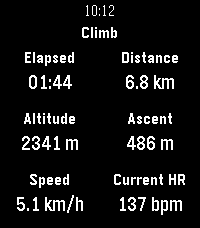

Watchapp Options
================

Stopped and Unavailable Screens
-------------------------------

The stopped screen contains no recording metrics or controls, even if Locus exposes generic
location or sensor values. The official `UpdateContainer API
<https://github.com/asamm/locus-api/blob/0.10.1/locus-api-android/src/main/java/locus/api/android/features/periodicUpdates/UpdateContainer.kt>`_
documents ``trackRecStats`` only for an active recording. Start recording in Locus Map. When Locus
cannot be reached, a distinct screen asks you to open Locus on the phone. Select has no action in
either state.

Activity Pages
--------------

An active recording shows one page at a time. Press **Up** for the previous page and **Down** for
the next; navigation wraps. A new recording or a mid-recording watchapp launch starts on page 1.
Manual selection survives pause and resume, but not a later recording. A settings refresh keeps the
selected page if its stable page ID remains and otherwise returns to page 1.

The header remains visible as ``Recording · 1/4`` or ``Paused · 1/4``. A snapshot older than 30
seconds is marked stale and unavailable values use an em dash.

Controls
--------

Press **Select** during an active recording:

.. list-table::
   :header-rows: 1

   * - State
     - Controls
   * - Recording
     - Pause, Stop & save, Waypoints
   * - Paused
     - Resume, Stop & save
   * - Stopped or unavailable
     - No controls

**Stop & save** requires confirmation. On a microphone watch, **Waypoints** opens a submenu with
**Quick waypoint** and **Dictated waypoint**. Quick waypoint saves ``Pebble waypoint`` directly;
dictation uses the confirmed transcription. A build without microphone support keeps a direct
quick-waypoint action.

.. image:: _static/screenshot_emery_waypoints.png
   :alt: Waypoints submenu with quick and dictated waypoint
   :align: center
   :width: 260px

Heart Rate
----------

``Current HR`` is the value in Locus telemetry and can be displayed on either supported watch.
Pebble Time 2 can additionally forward its own heart-rate samples to Locus when enabled in Watch
Settings. Forwarding is best effort because Locus does not acknowledge that sensor interface.
